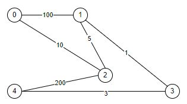

# Algorytm Dijkstry

Algorytm Dijkstry wykorzystywany jest do znajdowania najkrótszej ścieżki z źródła do pozostałych wierzchołków w grafie.

## Opis algorytmu

Rozważamy graf *G*=(V,E), gdzie *V* jest zbiorem wierzchołków grafu i *E* jest zbiorem krawędzi. Dla każdej krawędzi z *u* do *v* należącej do zbioru *E* zdefiniowana jest funkcja *w*(u,v) przypisująca nieujemną wagę tej krawędzi. Dla danego źródła *s* należącego do wierzchołków grafu wyznacznamy najkrótsze ścieżki do pozostałych wierzchołków.

##### Przebieg algorytmu

Wierzchołek *s* umieszczamy w kolejce priorytetowej z oszacowaną odległością od źródła równą 0. Do momentu, gdy kolejka nie jest pusta zdejmujemy wierzchołek. Dla każdej nieodwiedzonej krawędzi wychodzącej z zdjętego wierzchołka, wykonujemy operacje relaksacji:

```python
    def relax(u,v, weight):
        if d[v] > d[u] + weight:
            d[v] = d[u] + weight
            parent[v] = u
            heapq.heappush(queue, (d[v], v)) 
```
Po opróżnieniu kolejki zwracamy końcowe najmniejsze odległości od wierzchołka *s*.

##### Złożoność obliczeniowa

Algorytm przechodzi przez wszystkie  |*E*| krawędzi grafu i wykonuje potencjalnie |*V*| operacji wstawiania i usuwania elementów z kolejki. Dzięki zastosowaniu algorytmu heapqueue operacje wstawiania i usuwania wierzchołków z kolejki mają koszt obliczeniowy O(logV). Zatem końcowa złożoność algorytmu wynosi O(E*logV).

##### Reprezentacja grafu

Algorytm przyjmuje graf w postaci listy sąsiedztwa z wagami.
Dla poniższego przykładu przedstawiona jest reprezentacja graficzna.
```python
    G = [
        [(1,100), (2,10),],
        [(0,100), (2,5), (3,1)],
        [(0,10), (1,5), (4,200)],
        [(1,1), (4,3)],
        [(2,200), (3,3)]
```
